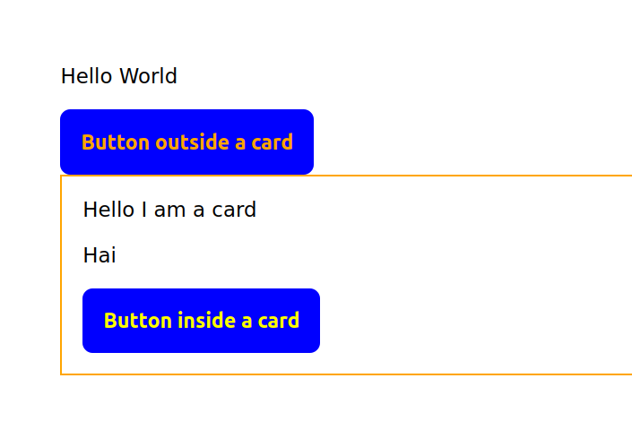
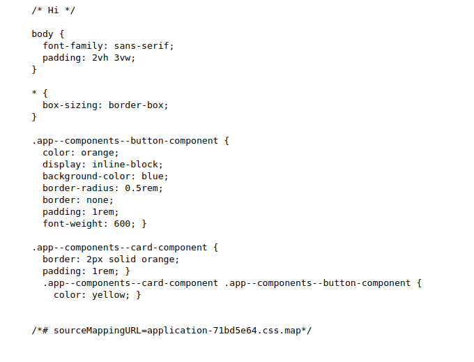
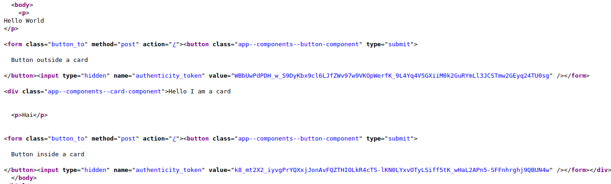

# Rails View Component based CSS encapsulation

Demonstrates a technique to automatically encapsulate View Component sidecar CSS.

See [the feature's PR](https://github.com/bessey/rails-css-component-techniques/pull/1) to find the interesting bits from the Rails cruft.

If you don't want to download and run yourself, here's the relevant results:

## Rendered

## CSS Output

## HTML Output

